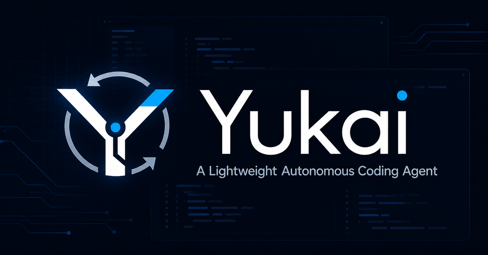

> **Yukai**\
> &#x20;*A Lightweight Autonomous Coding Agent*

由冯逸康独立设计与实现的本地编程智能体，用于南京大学软件学院推免考核。

<p align="center"></p>

Yukai 直接调用 DeepSeek 的 OpenAI 兼容 Chat Completions 接口，不使用任何 Agent 框架或服务端代码执行工具。对话历史、上下文裁剪、工具定义与执行、循环控制、审批、错误处理、审计和撤销都由本项目实现。

## 主要能力

- 自主浏览、搜索、读取和修改指定工作区；
- 执行测试、编译、格式化等本地命令；
- 使用 DeepSeek V4 Pro 原生 tool calling 完成多轮任务；
- 证据约束任务计划：复杂任务以结构化步骤推进，完成步骤必须关联真实工具结果；
- 精确文本编辑：匹配数量不符时拒绝写入，避免静默误改；
- 路径沙箱：拒绝绝对路径、`..`、符号链接逃逸和敏感文件；
- 分级审批：`--yes` 自动批准安全操作，高风险命令仍需确认，灾难性命令直接拦截；
- 写前快照与 `:undo` 撤销；
- JSONL 事件日志和明确的循环终止原因；
- 本地 Web 控制台：持久化会话，实时展示模型轮次、真实上下文用量、工具调用和审批请求；
- 可随时停止模型等待或正在执行的命令，并按写前快照查看文件统一 Diff；
- Python Agent 核心零第三方运行时依赖，支持 Python 3.10+。

## 安装

Windows PowerShell：

```powershell
git clone https://github.com/2022211932/Yukai-A-Lightweight-Autonomous-Coding-Agent.git
cd Yukai-A-Lightweight-Autonomous-Coding-Agent
python -m venv .venv
.venv\Scripts\Activate.ps1
python -m pip install -e .
setx DEEPSEEK_API_KEY "你的密钥"
cd web
npm install
cd ..
```

Web 控制台需要 Node.js 22+，`npm install` 只需在首次安装或前端依赖变化后执行。设置密钥后请打开一个新终端。macOS/Linux 使用：

```bash
export DEEPSEEK_API_KEY="你的密钥"
python -m pip install -e .
```

可选变量见 [.env.example](.env.example)。程序也会读取工作区中未入库的 `.env`，但 Agent 工具本身不能访问该文件。

## 使用

直接执行单个任务：

```powershell
yukai --workspace D:\path\to\project "阅读项目，修复失败的测试并验证"
```

进入类似 Claude Code 的常驻交互模式：

```powershell
yukai --workspace D:\path\to\project
```

启动可视化控制台：

```powershell
yukai --web
```

该命令会在浏览器打开 Yukai Console。点击顶部工作区路径，可以从最近项目或“此电脑”浏览并选择本机项目；选择结果会被记住，下次执行 `yukai --web` 时自动恢复，无需重复填写 `--workspace`。首次启动默认使用当前目录，也仍可用 `--workspace` 指定初始项目。

中央时间线实时显示用户指令、模型轮次、工具调用及结果；右侧显示真实消息字符用量、上下文压缩次数、工作区文件和修改摘要。审批完成后，原审批卡会从 `REVIEW` 更新为 `ALLOWED` 或 `REJECTED`；最终回答支持安全的 Markdown 标题、列表、加粗和行内代码显示。点击文件变更卡片可查看相对写前快照的统一 Diff；任务运行时输入框右侧会出现“停止任务”，它会中断模型等待，并终止正在运行的命令进程树。

复杂任务会在右侧生成实时任务计划。计划步骤分为检查、修改、验证和其他四类；步骤被标记为完成时，必须引用对应类型的成功工具结果作为证据。例如，“运行完整测试”只能绑定退出成功的 `run_command` 结果。仍有待处理步骤时，后端会拒绝 Agent 提前报告完成；无法继续的步骤必须声明阻塞类型并给出原因，除“等待用户输入”外还必须绑定检查或失败工具证据。简单问答和单次只读查询可以跳过计划，避免增加不必要的模型轮次。

会话内容、标题、置顶和归档状态按工作区保存。关闭并重新启动 `yukai --web`，或切换到其他项目再切回来，历史会话都会恢复。输入框右侧的审批开关可在手动审批与自动审批之间切换。手动模式下，写文件、建目录和执行命令会弹出审批窗口；自动模式只跳过安全操作的逐次确认，高风险命令仍会弹窗。控制接口只监听 `127.0.0.1`，并使用启动时生成的随机令牌验证请求。

启动后可以连续输入任务，后续任务会保留本次会话中之前的用户指令、模型回答和工具结果：

```text
╭─ Yukai 0.2.0 ─────────────────────────────────────────────────────────╮
│  Model      deepseek-v4-pro
│  Workspace  D:\path\to\project
│  Safety     ask before changes
│  /help for commands · /exit to quit
╰───────────────────────────────────────────────────────────────────────╯

❯ 阅读项目并告诉我测试入口
```

斜杠命令：

- `/help`：显示命令列表；
- `/status`：显示模型、工作区、审批模式和上下文大小；
- `/history`：显示当前会话的用户指令；
- `/clear`：清空对话上下文，但不改变文件；
- `/undo`：恢复最近一次 `write_file` 或 `edit_file` 之前的文件状态；
- `/exit`：退出。

在行尾输入 `\` 可以继续编写多行任务。普通修改操作的审批提示支持 `y`（本次允许）、`n`（拒绝）和 `a`（本次会话后续安全操作自动允许）；高风险操作只支持本次允许或拒绝。旧的 `:undo`、`:help` 等写法仍兼容。

常用选项：

```text
-w, --workspace PATH   限定 Agent 可访问的根目录（Web 模式会记住最近项目）
-y, --yes              自动批准安全修改；高风险命令仍需确认
--model MODEL          临时覆盖模型
--max-steps N          临时覆盖最大模型轮数
--no-color             关闭 ANSI 颜色
--web                  打开本地可视化控制台
```

## 运行机制

```text
用户任务
  -> 上下文管理器
  -> DeepSeek Chat Completions
  -> 解析 tool_calls
  -> 审批与本地执行
  -> tool 结果写回对话
  -> 继续调用模型或终止
```

每轮模型返回没有工具调用时，文本成为最终回答；达到最大轮数时以 `step_limit` 终止。429、超时和部分服务端错误使用指数退避重试。工具错误会作为结构化结果返回模型，由模型在下一轮自行修正。

对于多步骤任务，Agent 还会维护由后端校验的结构化计划。每次真实工具执行都会获得运行期证据 ID；检查步骤只能使用环境、浏览、读取或搜索证据，修改步骤只能使用成功写入证据，验证步骤只能使用退出成功的命令证据。阻塞步骤会记录工具失败、缺少前置条件、环境限制或等待用户输入四种原因。已完成步骤不能被删除或重新打开，从而避免模型通过改写计划掩盖尚未完成的工作。

系统提示会向模型注入当前操作系统、实际 shell 和当前工作区，降低在 Windows 上误用 `ls`、`find` 等 Unix 命令的概率。执行 `npm test` 或包管理器脚本前，工具层还会检查当前目录是否存在 `package.json` 以及目标脚本是否已定义；检查失败不会弹出无意义的审批，也不会启动子进程。

上下文超过预算时，以“assistant 工具调用 + 对应 tool 结果”为不可拆分块保留最近内容，同时始终保留系统提示和原始任务，避免产生没有对应调用的孤立 `tool` 消息。

## 工具

| 工具 | 功能 | 默认需批准 |
| --- | --- | --- |
| `get_environment` | 获取操作系统、shell、Python 和当前工作区 | 否 |
| `list_files` | 递归列出项目结构 | 否 |
| `read_file` | 分段读取带行号 UTF-8 文本 | 否 |
| `search_text` | 按文件 glob 搜索字面文本 | 否 |
| `write_file` | 原子创建或覆盖文本文件 | 是 |
| `edit_file` | 按预期次数精确替换 | 是 |
| `make_directory` | 创建目录 | 是 |
| `run_command` | 带超时执行本地 shell 命令 | 是 |

命令子进程不会继承名称含 `KEY`、`TOKEN`、`SECRET` 或 `PASSWORD` 的环境变量。命令耗时从审批完成后开始计算，不包含用户思考时间；Windows 输出会在 UTF-8 失败时回退到系统编码。标准输出和错误输出分别限制长度，并过滤 Yukai 内部状态目录，避免异常日志占满模型上下文或绕过文件工具的访问限制。

### 危险命令防护

`--yes` 和 Web 控制台的自动审批只会自动放行工作区内文件操作，以及测试、构建、静态检查和只读 Git 等白名单命令。安全策略不会因自动审批而关闭：

- 删除文件、强制 Git、提权、修改权限、跨工作区路径和未知 shell 命令始终要求人工确认；
- 关机重启、磁盘格式化、原始设备写入、fork bomb、递归删除系统根目录或用户目录会被直接拒绝；
- 带管道、重定向、命令替换或多命令连接符的复合 shell 指令按高风险处理；
- 高风险确认只对当前一次操作有效，不能选择“一次允许后全部放行”。

这是一层纵深防护而不是完整 shell 沙箱。对于不可信项目，仍建议在虚拟机、容器或权限受限的专用账户中运行 Yukai。

## 本地状态

运行后工作区会产生未入库目录 `.yukai/`：

```text
.yukai/
├── events.jsonl      # 模型轮次、工具结果、耗时与终止原因
├── snapshots.jsonl   # 文件写入前快照，供撤销和 Diff 使用
└── web_sessions.json # 当前工作区的 Web 会话、事件和上下文
```

事件日志不记录 API Key；审批界面对大段文件内容只显示字符数。

Web 控制台的最近项目列表保存在当前用户的本机配置目录：Windows 为 `%LOCALAPPDATA%\yukai\settings.json`，macOS/Linux 为 `$XDG_CONFIG_HOME/yukai/settings.json`（未设置时使用 `~/.config`）。其中只包含最近工作区路径，不包含 API Key。

## 测试

```powershell
$env:PYTHONPATH=(Resolve-Path src).Path
python -m unittest discover -s tests -v
```

测试使用 `FakeClient` 模拟模型，不消耗 API 额度，覆盖 Agent 循环、会话持久化、真实上下文统计、证据约束计划、包脚本预检、Windows 输出解码、审批生命周期与耗时、任务与命令中止、Diff、非法工具参数、上下文裁剪、路径逃逸、敏感文件、原子写入、精确编辑、撤销和命令环境隔离。

## 视频演示任务

先从模板生成一次性工作区：

```powershell
python scripts/prepare_demo.py
yukai -y -w demo-workspace "修复 slugify，使全部测试通过；不要修改测试，并在结束前运行完整测试。"
```

模板初始包含多个失败测试，可以展示 Agent 阅读文件、执行测试、定位问题、修改实现和回归验证的完整闭环。重复演示时删除 `demo-workspace` 后重新运行准备脚本即可。

## 设计边界

- 当前只处理 UTF-8 文本文件，不直接编辑二进制文件；
- 命令审批是安全边界的一部分；自动审批不会跳过高风险确认或灾难性命令拦截；
- 字符数仅作为无需 tokenizer 依赖的保守上下文估算，不等同于精确 token 数；
- 撤销针对 Agent 文件工具的最近写入，不尝试回滚命令产生的任意副作用。

DeepSeek 接口参数依据其[官方 Function Calling 文档](https://api-docs.deepseek.com/guides/function_calling/)和[模型说明](https://api-docs.deepseek.com/quick_start/pricing/)实现。

旧命令 `fyk-agent` 作为兼容入口继续保留，其功能与 `yukai` 完全一致。

## 作者

Feng Yikang（冯逸康）
